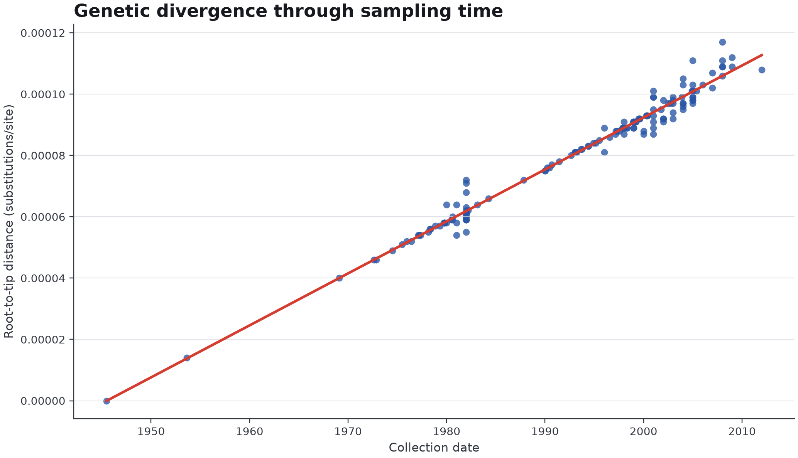
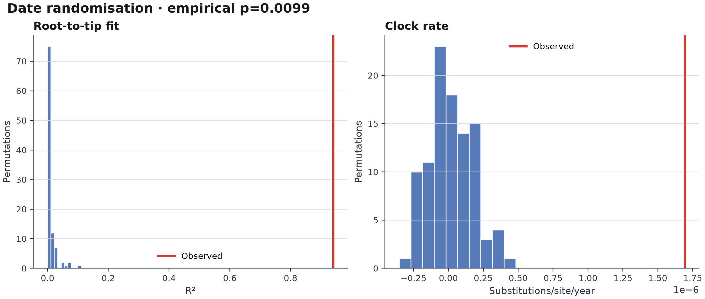
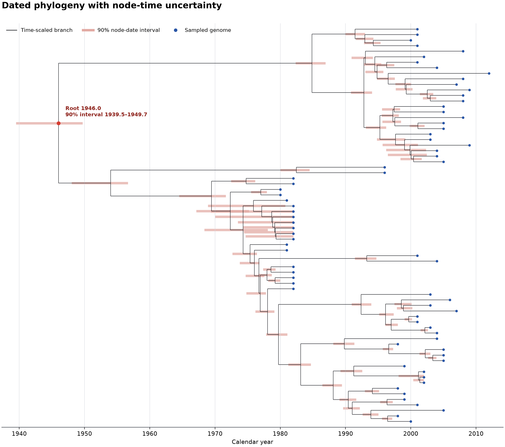
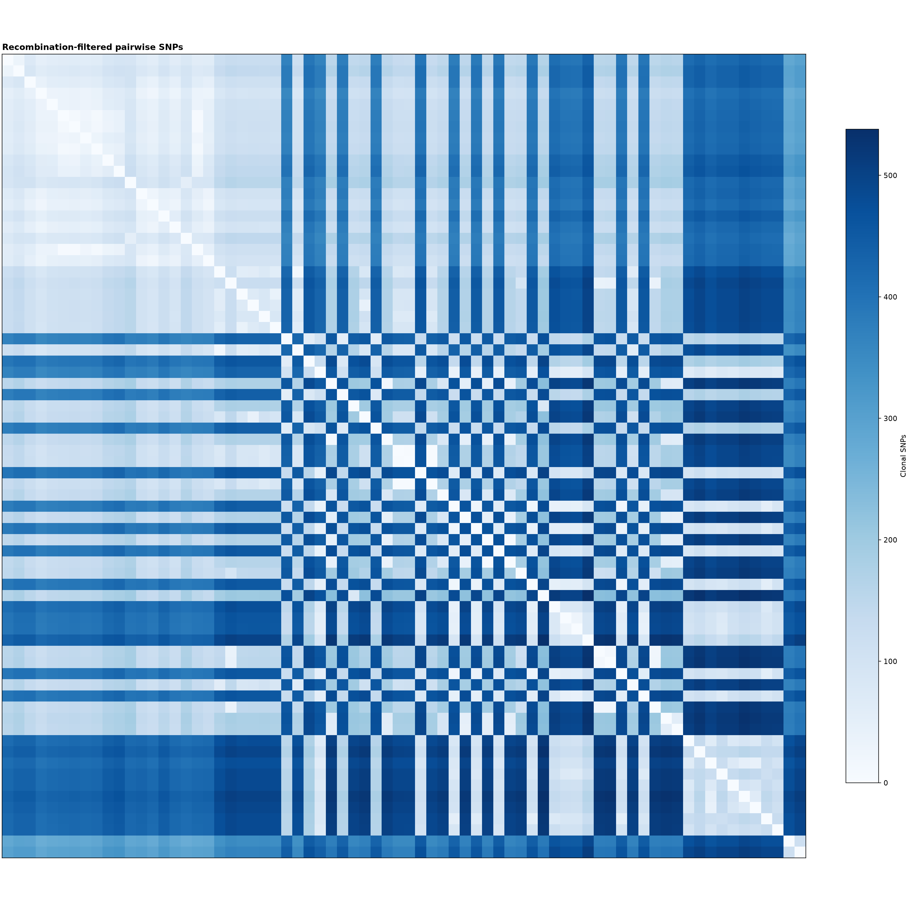

# Worked example: *Staphylococcus aureus* ST239

Baines and colleagues analysed 123 ST239 genomes sampled between 1980 and 2012.
They described two Australian clades and estimated a mean substitution rate of
1.6 x 10^-6 substitutions per site per year, with the emergence of ST239 dated
to 1946.[^baines]

ChronoClade was run on 72 assemblies from that collection available in the
AllTheBacteria 2025-05 release. The subset contains 69 Australian isolates, one
New Zealand isolate and two external comparators. Seventeen collection years
are represented.

## Prepare the assemblies

The repository records every accession and collection year in
`validation/st239_baines2015/input_manifest.csv`. The following commands
download the assemblies and create the ChronoClade metadata table:

```bash
mkdir -p validation/st239_baines2015/run

cut -d, -f1 validation/st239_baines2015/input_manifest.csv \
  | tail -n +2 \
  > validation/st239_baines2015/run/accessions.txt

pixi run atbfetcher accessions \
  validation/st239_baines2015/run/accessions.txt \
  --output validation/st239_baines2015/run/assemblies \
  --source aws \
  --threads 8

pixi run python validation/st239_baines2015/prepare_metadata.py \
  --assemblies validation/st239_baines2015/run/assemblies \
  --output validation/st239_baines2015/run/metadata.csv
```

The accession manifest is versioned. The downloaded assemblies are not.

## Run ChronoClade

```bash
pixi run chronoclade validate \
  validation/st239_baines2015/run/metadata.csv

pixi run chronoclade run \
  validation/st239_baines2015/run/metadata.csv \
  --output validation/st239_baines2015/run/results \
  --threads 8 \
  --lineage-jobs 1 \
  --randomisation-jobs 4 \
  --date-randomisations 100 \
  --seed 20260818
```

## Root-to-tip regression



The corrected tree gave an exploratory clock rate of 1.693 x 10^-6
substitutions per site per year and R² = 0.94. The positive relationship is
clear, but the regression alone does not establish temporal signal. Genetic
structure can produce a strong relationship between sampling time and
root-to-tip distance.

## Date randomisation



None of the 100 permuted datasets had an R² equal to or greater than the
observed value. With the one-count correction used by ChronoClade, the empirical
p-value was (0 + 1) / (100 + 1) = 0.0099. The observed clock rate was positive,
so the dataset passed the predefined temporal gate.

## Dated phylogeny



TreeTime placed the root in 1946. The plotted intervals are 90% marginal
max-posterior regions for internal-node dates. They express uncertainty under
the fitted TreeTime model; they do not include uncertainty caused by missing
genomes, residual recombination or the choice of population sample.

## Genomic structure



The corrected topology contained two longitudinal focal groups. Median clonal
distance was 124 SNPs within those groups and 454 SNPs between them. ChronoClade
therefore reported a working interpretation consistent with local persistence
plus additional introductions.

The interpretation was assigned low confidence. Only two external context
genomes were present, patient identifiers were unavailable, and branch support
from the corrected tree was not included. The result supports a line of
epidemiological enquiry rather than a final count of introductions.

[Open the complete example report](https://ghruproject.github.io/chronoclade/example-report/report.html){ .md-button .md-button--primary }
[Inspect the preserved results](https://github.com/ghruproject/chronoclade/tree/main/validation/st239_baines2015/results){ .md-button }

[^baines]: Baines SL et al. 2015. [Convergent Adaptation in the Dominant Global Hospital Clone ST239 of Methicillin-Resistant *Staphylococcus aureus*](https://doi.org/10.1128/mBio.00080-15). *mBio* 6:e00080-15.
