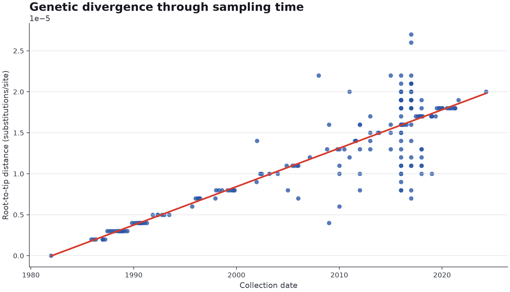
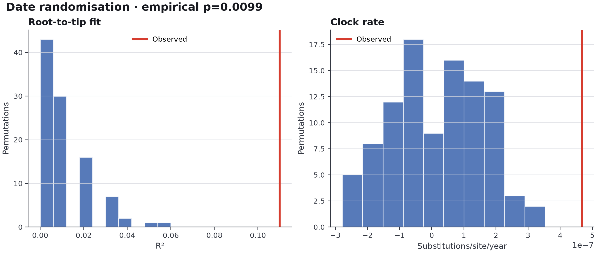
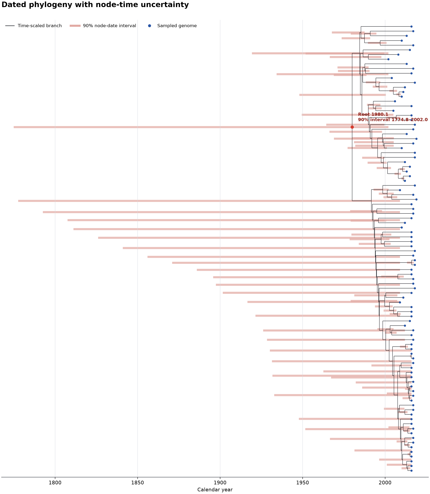

# Komori 2024 ST131-H30 validation

This validation uses the 96 *Escherichia coli* ST131-H30 clade C0/C1
chromosomes analysed in Figure 3 of Komori et al. (2024),
doi:[10.1128/aac.00817-24](https://doi.org/10.1128/aac.00817-24). The paper
estimated a dated phylogeny from 2,401 recombination-filtered core SNPs. It
reported the C1/C0 split around 1983 (95% HPD 1977–1988), the ancestor of
subclades 4–8 around 1992 (1988–1996), and subclade 5 around 1999
(1995–2002).

The comparison is deliberately not an attempt to reproduce the paper's BEAST
analysis exactly. ChronoClade uses TreeTime and its own mapping and filtering
workflow. The useful test is whether the accession-defined data pass the
temporal-signal checks and produce biologically compatible broad dates, not
whether two different models return identical point estimates.

## Data integrity

`prepare_dataset.py` reads the authors' Figure S5 workbook and selects the 94
C1 and two C0 records by their GenBank chromosome accessions. It does not
search for assemblies by strain name. Strain names are retained as display
labels and checked against NCBI, but are never used as identifiers.

The preparation step writes:

- `verified/accession_provenance.tsv`: paper accession, clade, date and country
  beside the live NCBI nucleotide record, BioSample and assembly identifiers;
- `verified/metadata.csv`: the 96-row ChronoClade input table;
- `verified/assemblies/`: the exact chromosome sequences named in Figure S5.

The workbook and downloaded genomes are ignored by Git. The workbook checksum
is pinned in the script, so an upstream replacement stops preparation until it
has been inspected.

Run the preparation inside the project environment:

```bash
pixi run python validation/komori2024_st131/prepare_dataset.py --download
```

The provenance table uses `pass`, `review` and `fail` deliberately. Missing
NCBI dates and country aliases remain visible for review; they do not replace
the authors' curated metadata. A different organism is a hard failure. ATB
availability is recorded for context, but this validation downloads the exact
GenBank chromosomes used by the paper rather than substituting a different
assembly of the same BioSample.

## Analysis

Check the input plan:

```bash
pixi run chronoclade validate \
  validation/komori2024_st131/verified/metadata.csv
```

Run the full analysis:

```bash
pixi run chronoclade run \
  validation/komori2024_st131/verified/metadata.csv \
  --output validation/komori2024_st131/verified/results \
  --threads 8 \
  --lineage-jobs 1 \
  --randomisation-jobs 8 \
  --date-randomisations 100
```

ChronoClade first maps the chromosomes with SKA and writes
`lineage_coherence.tsv`. An extreme raw-distance outlier stops the run before
IQ-TREE or ClonalFrameML. This is a data-integrity check, not evidence for or
against local transmission: plausible structure within a correctly defined
lineage is retained for the phylogenetic analysis.

Only a coherent set proceeds through maximum-likelihood tree inference,
ClonalFrameML recombination filtering and a second coherence screen on the
filtered distances. Only then does it proceed to root-to-tip regression, date
randomisation and TreeTime dating. The HTML report and its CSV, TSV, SVG, PNG,
Newick and JSON evidence files are written under `verified/results/`.

## Observed result

The accession-defined run completed on 5 September 2026.

| Check | Result |
| --- | --- |
| Input identity | 96 unique paper accessions; all resolved to *E. coli* |
| Raw lineage coherence | Passed; 0/96 flagged, median per-genome distances 91–337 SNPs |
| Filtered lineage coherence | Passed; 0/96 flagged, median per-genome distances 52–130 clonal SNPs |
| Root-to-tip regression | Positive rate 4.674 x 10^-7 substitutions/site/year; R² 0.11 |
| Date randomisation | Passed; 0/100 null R² values reached the observed value; empirical p=0.0099 |
| Fixed-root dated-tree fit | Rate 4.466 x 10^-7 substitutions/site/year; R² 0.11 |
| Root estimate | 1980.1; 90% TreeTime interval 1774.8–2002.0 |







The point estimate is close to the paper's C1/C0 estimate of about 1983, but
TreeTime's interval for the root is far wider than the paper's BEAST interval.
These are therefore two separate conclusions: this dataset contains detectable
temporal signal, while its TreeTime root date is poorly constrained. The report
marks the time-scaling stage `REVIEW ROOT DATE` and does not present the root
point estimate as a precise public-health date.
